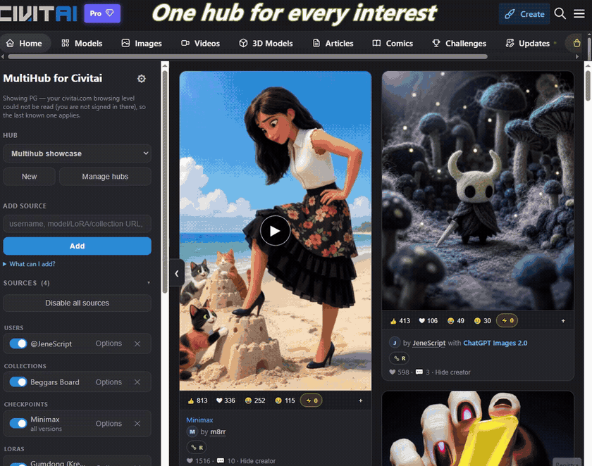
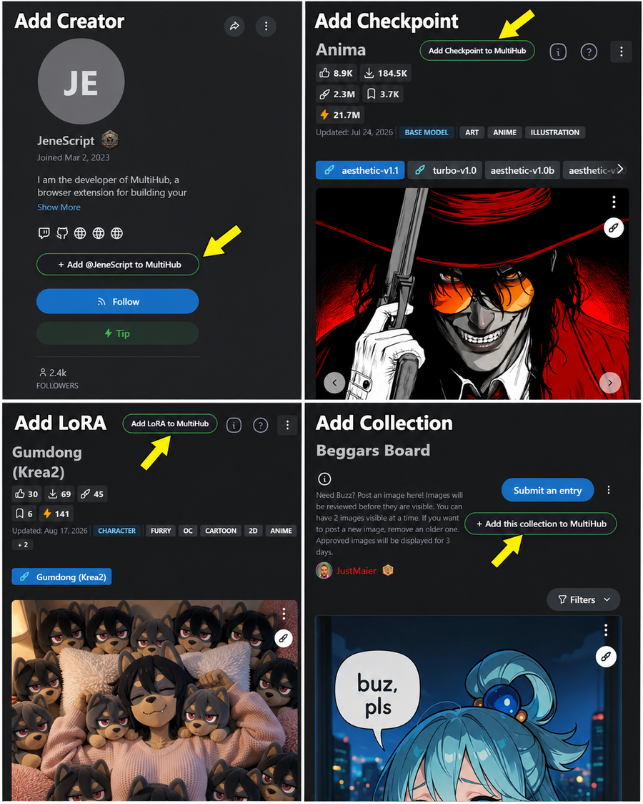

# MultiHub for Civitai - Unofficial

## Build the Civitai feed you actually want

MultiHub turns the Civitai creators, models, LoRAs, versions, and public image collections you care
about into personal feeds called **hubs**. It merges, sorts, and deduplicates those sources so you
can open one focused feed instead of checking the same pages one by one.

Civitai is excellent for broad discovery. MultiHub is for the creators and resources you already
know you do not want to miss.

> **Browser installation:** [install MultiHub from the Chrome Web Store](https://chromewebstore.google.com/detail/multihub-for-civitai-unof/nojkmfegfgplbclepjlnkmdcmngeahbj)
> or [install MultiHub from Firefox Add-ons](https://addons.mozilla.org/en-US/firefox/addon/civitai-multihub-unofficial/).
> Store installations update automatically. Version `0.13.2` is the current GitHub release;
> marketplace availability can lag while browser-store reviews are in progress.

This repository is the auditable open-source implementation of the extension. It lets users and
reviewers inspect exactly what MultiHub stores, which Civitai requests it makes, and how release
packages are built. Manual installation remains available for development, security review and the
complete GitHub build, but ordinary Chrome and Firefox users should use their browser's store.

> **Independent project.** MultiHub is not an official Civitai product, partnership, or endorsement.

**[Install for Chrome](https://chromewebstore.google.com/detail/multihub-for-civitai-unof/nojkmfegfgplbclepjlnkmdcmngeahbj)** ·
**[Install for Firefox](https://addons.mozilla.org/en-US/firefox/addon/civitai-multihub-unofficial/)** ·
**[Audit or install manually](#manual-installation-for-development-or-security-review)** · **[Privacy](PRIVACY.md)** ·
**[Security](SECURITY.md)** ·
**[Report an issue](https://github.com/trunksn1/Civitai-MultiHub/issues)**

## One hub for every interest

A hub is a group of Civitai galleries—creators, checkpoints, LoRAs, selected model versions, and
public collections—that MultiHub turns into one feed. Make one for creators you check every day,
another for a particular character or workflow, and another for anything else you want to keep
separate.

Instead of relying on one broad discovery or following feed, you choose exactly which sources
belong together. Switch hubs and the entire feed changes. Results from every source are sorted
together and deduplicated, so media that matches several sources still appears only once.



## Why use MultiHub?

- **Stop checking pages separately.** Put selected creators, models, LoRAs, versions, and public
  image collections into one continuously loaded feed.
- **Keep different interests separate.** Give every project or mood its own hub, sources, filters,
  sort order, and viewed history.
- **See what changed.** NEW markers and viewed filters make a hub useful when you return tomorrow,
  not only when you create it.
- **Keep the context.** Open prompts, resources, generation information, comments, and Civitai
  actions without losing your place in the feed.
- **Keep control of your data.** There is no MultiHub account, analytics, advertising, or
  developer-operated application server.

Starting with `0.12.4`, the Chrome Web Store, Firefox Add-ons, and manual packages run on both
`civitai.com` and `civitai.red`. The `.red` domain can expose mature user-generated content according
to the browsing levels selected in the user's Civitai account.

## Install from the Chrome Web Store

1. Open [MultiHub for Civitai - Unofficial in the Chrome Web Store](https://chromewebstore.google.com/detail/multihub-for-civitai-unof/nojkmfegfgplbclepjlnkmdcmngeahbj).
2. Select **Add to Chrome**, then approve the permissions shown by Chrome.
3. Refresh any `civitai.com` or `civitai.red` tab that was already open.
4. Optionally pin MultiHub from Chrome's extensions menu. Its toolbar icon opens the standalone feed.

Chrome handles updates automatically. The `0.13.2` package requests access to both Civitai domains;
existing users who have not yet approved `civitai.red` site access may be asked to do so.

## Install from Firefox Add-ons

1. Open
   [MultiHub for Civitai - Unofficial on Firefox Add-ons](https://addons.mozilla.org/en-US/firefox/addon/civitai-multihub-unofficial/).
2. Select **Add to Firefox**, then approve the permissions shown by Firefox.
3. Refresh any `civitai.com` or `civitai.red` tab that was already open.
4. Optionally pin MultiHub to the Firefox toolbar. Its toolbar icon opens the standalone feed.

Firefox updates the add-on automatically. The `0.13.2` package requests access to both Civitai
domains. Existing users who have not yet approved `civitai.red` site access may be asked to do so.

## Manual installation for development or security review

Chrome cannot load an extension directly from a ZIP file. Extract the ZIP first, then select the
folder that contains `manifest.json` directly. Manually installed copies do not update automatically.

### Install a signed release asset manually

Take the newest entry on the
[Releases page](https://github.com/trunksn1/Civitai-MultiHub/releases), currently `v0.13.2`. Every
release from `v0.9.0` on carries its packages under **Assets**; older versions remain published so
an installation can be pinned or rolled back.

1. Under the `v0.13.2` release, download `civitai-multihub-full-v0.13.2.zip` and its `.sha256` file.
   Make sure the ZIP is an asset on the **Releases** page, not GitHub's automatic source archive.
   All `0.13.2` package variants include both Civitai domains.
2. Extract the ZIP to a permanent folder. Open it and confirm that `manifest.json` is directly
   inside that folder.
3. Open `chrome://extensions` and enable **Developer mode**.
4. Select **Load unpacked**, then select the extracted folder containing `manifest.json`.
5. Refresh every `civitai.com` or `civitai.red` tab that was already open.

### Install directly from repository source

1. On the [repository page](https://github.com/trunksn1/Civitai-MultiHub), select
   **Code -> Download ZIP**, then extract it.
2. Open the extracted `Civitai-MultiHub-main` folder.
3. Open `chrome://extensions`, enable **Developer mode**, and select **Load unpacked**.
4. Select **`Civitai-MultiHub-main/extension`**. Do **not** select `Civitai-MultiHub-main`, the
   repository root. The selected `extension` folder must contain `manifest.json` directly.
5. Refresh every Civitai tab that was already open.

### Move from an unpacked installation to a store edition

A store edition is a separate browser-extension installation, so hubs stored by an unpacked copy do
not transfer automatically. Move them without risking the original copy:

1. Open the unpacked MultiHub installation and export the hubs you want to keep.
2. Install MultiHub from the Chrome Web Store or Firefox Add-ons using the links above.
3. Open the store edition and import the exported hub file.
4. Confirm that the expected hubs and sources are present, then remove the unpacked installation
   from `chrome://extensions` or `about:addons`.

API keys and viewed-image history are deliberately excluded from hub exports. Configure a key again
only if you need one. Chrome and Firefox store editions support `civitai.red` starting with `0.12.4`.

## Quick start

1. Open MultiHub from the browser toolbar or the injected **MultiHub** item on Civitai.
2. Use the initial **My hub**, or create and name another hub.
3. Add a creator name, model ID, Civitai creator/model URL, or public image-collection URL.
4. Choose model versions when prompted. Public collections need no API key when a signed-in
   Civitai tab is open; an API key remains an optional fallback.
5. Pick a sort order and filters, then scroll the merged feed.

## Update, remove, or repair the extension

Chrome Web Store and Firefox Add-ons installations update automatically. The following instructions
apply only to an unpacked/manual installation.

To update a Release installation, export any important hubs first, download and verify the newer
release asset, and replace the files inside the same permanent extension folder. Then open
`chrome://extensions`, select **Reload** on MultiHub, and refresh every open Civitai or standalone
MultiHub tab. Keeping the same folder path avoids Chrome treating the unpacked copy as a separate
installation.

To update a source installation, replace or update the repository checkout, select **Reload** on
`chrome://extensions`, and refresh the open tabs. Always keep **Load unpacked** pointed at the
repository's `extension` subfolder.

To remove MultiHub, export hubs you want to keep, open the browser's extension manager, and select
**Remove**. Uninstalling removes browser-managed MultiHub storage from that installation; it cannot undo
reactions, comments, or collection changes already submitted to Civitai.

If an updated extension reports that `chrome.runtime` or `getURL` is unavailable, or the old UI is
still visible, refresh the affected Civitai tab. Existing tabs retain the old content-script context
after an extension reload. If the browser rejects the selected folder, check that `manifest.json` is
directly inside it and that you did not select a ZIP or the repository root.

## Privacy, permissions, and API keys

- MultiHub stores hubs, sources, filters, viewed markers, hidden creators, and preferences in the
  user's browser profile. It does not use browser sync.
- Creator and model feeds work **without an API key**. Public collection feeds, image comments and
  generation details can use an open, signed-in Civitai tab instead of an API key.
- Collection reads, the collection picker, add-to-collection actions, comment threads, posting a
  comment and generation details first use that tab's existing session. MultiHub does not read,
  copy, or store Civitai session cookies.
- A supplied API key stays in `chrome.storage.session` by default. Choosing **Remember this API key
  on this device** also saves it in persistent, unencrypted `chrome.storage.local` extension
  storage until the user removes it or uninstalls MultiHub.
- For API-key fallback, use only the scopes needed: `MediaRead` for generation details and comment
  previews, `CollectionsRead` for collection feeds and the picker, `CollectionsWrite` to add media
  to a collection, and `SocialWrite` for reactions and comments.
- MultiHub operates no analytics, advertising, telemetry, or application server. Feature requests
  go directly from the browser to Civitai and its media services.
- The manifest requests only extension `storage` and host access to
  `https://civitai.com/*` and `https://civitai.red/*`. It does not run on unrelated sites or request
  general browsing history.
- `civitai.red` support can expose mature user-generated content according to the user's selected
  browsing levels, Civitai account, and Civitai's own availability. Use that domain deliberately.
- Some optional collection, generation-detail, comment, and reaction features depend on internal
  Civitai tRPC procedures. They are experimental, are not covered by the expressed interest in the
  hub concept, and may change or disappear without notice.

Read the full [privacy policy](PRIVACY.md) and [security policy](SECURITY.md) before entering a key
or distributing the extension.

## Main features

- Multiple independent hubs built from creators, models, LoRAs, selected model versions, and public
  image collections.
- A dedicated hub manager for choosing a default hub, renaming, multi-delete, and single- or
  multi-hub export/import.
- One globally sorted, deduplicated feed with media, aspect-ratio, period, browsing-level, viewed,
  creator, prompt, resource, and generation-metadata filters.
- Standalone and embedded Civitai experiences with host-preserving links.
- Source aliases, enable/disable controls, bulk management, and hub import/export.
- Image/video viewer with prompts, generation data, resources, comments, and optional scoped
  Civitai actions.
- Always-visible card reactions, donated-Buzz links, NEW state, creator avatars, P/R publication
  markers, and direct Civitai Remix actions.
- No MultiHub account, analytics, or developer-operated backend.

## Detailed feature guide

### Multiple personalized hubs

A hub is a saved collection of sources and feed preferences. You can create separate hubs for
different styles, subjects or workflows—for example, one for followed artists, one for Flux
resources and another for curated public collections.

For every hub you can:

- Create, select and manage it from one dedicated dialog.
- Mark one hub as the default opened by the toolbar, embedded panel and future browser sessions.
- Rename one selected hub, delete several selected hubs, or export several hubs in one file.
- Maintain an independent source list.
- Choose its sort order, time period and media filters.
- Choose comfortable or compact cards, whether videos autoplay, and optionally play every video
  that is at least 15% visible.
- Hide media already viewed in that hub.
- Optionally group images belonging to the same Civitai post.
- Keep independent viewed-image history and last-visit time.
- Export or import one or several hubs as a shareable JSON file.

Any Add-to-MultiHub source picker can also create and name a new hub with that source already in
it. Existing hubs are sorted alphabetically, searchable by name, and shown in a height-limited list
that scrolls after roughly five entries.

Deleting hubs requires confirmation. If every hub is deleted, MultiHub creates a new empty hub so
the extension always remains usable. The selector emphasizes the active hub and marks the default
with a star; source counts remain in the Sources panel instead of crowding hub names. Hub names are
normalized and limited to 30 characters so selectors and Civitai-page menus remain compact.

### Supported source types

| Source | What MultiHub follows | How it is added |
|---|---|---|
| Creator | Media posted by one Civitai username | Username, `@username` or creator URL |
| Checkpoint | Galleries for the selected model versions | Model URL or numeric model ID |
| LoRA | Galleries for the selected LoRA versions | Model URL or numeric model ID |
| Embedding | Galleries for the selected embedding versions | Model URL or numeric model ID |
| Other model type | Galleries exposed through the model's versions | Model URL or numeric model ID |
| Public image collection | Images currently accepted into a public Civitai image collection | Full collection URL |

When adding a model, MultiHub resolves its real name, type and versions. You can follow all
available versions or enter specific version IDs. A URL containing `modelVersionId` starts with
that version selected. Following “all versions” is capped to the newest configured versions
(10 by default) to prevent a single model from creating an unbounded number of API streams.

Public collection sources are dynamic: refreshing the feed sees images subsequently added to or
removed from that collection. They are not expanded into a frozen list of individual users or
models. Public collection metadata and media are requested through an open signed-in Civitai tab,
with an API-key or anonymous direct request as fallback. At present, Civitai collections whose type
is `Image` are supported; Model, Post and Article collections are rejected.

### Adding sources from Civitai pages

On supported creator, model and collection pages, an **Add to MultiHub** button opens a hub picker.
Checkpoint, LoRA and embedding pages with more than one version first ask whether to follow all
versions or only the version currently shown. Models with a single version go directly to the hub
picker; creator and collection pages never show a version question.



The Civitai home page also receives full-text actions beside **Featured Images** and visible public
collection headings: **Add Featured to MultiHub** and **Add this collection to
MultiHub**. The Featured Images action offers the creator, model, and collection sources Civitai
actually exposes in that section.

The picker includes:

- A hub selection step.
- A Back control when version scope was selected first.
- A visually separated **Create a new hub** action with an inline name field.
- Alphabetical existing hubs, a name search, and a scrolling five-row list.
- A Close button.
- The ability to click **Add to MultiHub** again to close an accidental opening.
- A short success, duplicate or failure result before returning to the normal button.

Sources can also be pasted into the **Add source** field in the MultiHub sidebar. Duplicate users
are compared case-insensitively, duplicate collections are matched by collection ID, and repeated
model additions merge newly selected version IDs where appropriate.

Inside MultiHub, hovering or focusing a creator, model, collection, generation resource, preview
source control, or comment author opens the same add-source flow without leaving the current feed.

### Source organization and controls

The collapsible **Sources** section only shows categories present in the current hub. Sources are
grouped as Users, Collections, Checkpoints, LoRAs, Embeddings and Models.

Each source provides:

- An enable switch. Disabling a source temporarily mutes it without deleting its configuration or
  making feed requests for it.
- An **Edit** dialog for assigning a short local display name. The alias is shown in the feed while
  the original source name remains available as context.
- Model-version editing for model sources.
- Copy or move to another existing hub.
- Removal with confirmation.

The top-level **Disable all** / **Enable all** control mutes or restores every source in the current
hub with one click. **Manage sources** reveals separate bulk-selection checkboxes. You can select
or deselect all sources and then copy, move or remove the selection. Copy keeps the originals in
the current hub; Move adds them to the destination and removes them from the current hub.

Each source has an **Options** dialog for choosing an alias and, for models, editing versions.
Separate Copy and Move actions open a destination list; a new destination hub can be created and
named without leaving the dialog.

### One merged and deduplicated feed

Every enabled source opens one or more paginated streams. Creator and collection sources use one
stream; a model uses one stream for every followed model version. MultiHub merges those streams
and deduplicates media by Civitai image ID. If the same image matches several sources, it appears
once while retaining every matching source label.

Available global orders are:

- **Newest first**
- **Oldest first**
- **Most reactions**
- **Most comments**

The selectable time periods are All Time, Year, Month, Week and Day. Date sorts use each stream's
pagination frontier so MultiHub reveals only the portion known to be correctly ordered. Reaction
and comment sorts are approximate: Civitai pages are ordered using an internal engagement score
that does not always equal the visible raw totals. MultiHub reorders the fetched pool by visible
counts, but guaranteeing an exhaustive global order would require downloading every page from
every source.

Scrolling loads additional pages automatically. **Refresh feed** starts a fresh run and adds a
per-run cache-busting token because the legacy Civitai image endpoint can otherwise return an edge-
cached snapshot for several minutes.

### Feed filters and display preferences

The sidebar exposes frequently changed feed filters:

- Images and videos, images only, or videos only.
- Any shape, portrait, landscape or square-ish aspect ratio.
- Feed order and time period.

The Settings dialog contains less frequently changed presentation options:

- Comfortable or compact card density.
- Autoplay videos near the viewport.
- Hide previously viewed images.
- Group images from the same post.
- Clear the current hub's viewed history.

Local filters reflow already fetched cards without downloading the entire feed again. The masonry
layout recalculates after density changes, sidebar changes, window resizing and creator hiding.
Where possible, it preserves the current visible card and reading position.

### New and viewed media

MultiHub records when a hub was last visited and marks an image **NEW** only when it was posted
after the previous visit and has never been viewed in that hub. Media is recorded as viewed after
enough of its card enters the viewport. When
**Hide previously viewed images** is enabled, those IDs are filtered out locally.

Viewed history is bounded to the latest 3,000 IDs per hub. It can be cleared from Settings and is
excluded from exported hub files.

### Creator blacklist shared by every hub

Every card has a **Hide creator** action. Hiding a creator:

- Adds the username to one global, case-insensitive blacklist.
- Removes all already-fetched cards by that creator immediately.
- Reflows the remaining masonry cards without refreshing the feed.
- Preserves the current reading position when possible.
- Applies to every hub.

Settings has a dedicated **Hidden creators** tab where usernames can be added manually, reviewed
and restored. Legacy per-hub blacklist entries are migrated into the global list.

### Image and video cards

Cards preserve the media's reported aspect ratio. Their information area shows the source or
collection, linked creator with a profile picture, the generation checkpoint when it can be
resolved, reaction total, comment count and **Hide creator** action. The card date is intentionally
omitted. When the REST image feed omits the author's profile object, MultiHub resolves the public
Civitai creator profile and caches its avatar instead of stopping at an initial.

The reaction strip stays visible below the media instead of overlaying it. Its donated-Buzz pill
opens the canonical image page, where the user can donate through Civitai itself. Compact **P** and
**R** pills report whether the prompt and resources were published, and a Remix pill opens the
image's native Civitai remix flow.

Video cards:

- Display an unmistakable play overlay when autoplay is disabled or the video is paused.
- Toggle play/pause from that overlay.
- Pause outside the viewport.
- Respect the browser's reduced-motion preference.
- Play only the most-visible video by default, or opt into playing every video that is at least 15%
  visible. The simultaneous mode is off by default because it can significantly increase CPU/GPU,
  memory and bandwidth use.

With an API key, the card exposes direct Like, Heart, Laugh and Cry reaction controls plus an
**Add to collection** control. Counts and selected states update immediately, then roll back if
Civitai rejects or cannot confirm the request. Reactions toggled during the current MultiHub
session receive a blue selected state. MultiHub does not currently preload all of the account's
historical reaction state for ordinary REST-feed cards.

### Full media viewer

Clicking a card opens MultiHub's lightbox. The media is contained within the available area without
cropping, so portrait, landscape and unusual aspect ratios remain fully visible. Previous and Next
buttons navigate the currently merged sequence; Escape or the Close button dismisses the viewer.
Clicking a still image or **Open on Civitai** opens its original Civitai image page.

The information panel can show:

- Linked creator and local posting date/time.
- Like, Heart, Laugh and Cry totals/actions on one row with the Buzz link.
- Add-to-collection beside the posting date, above reactions and Buzz.
- Positive prompt and negative prompt.
- Seed, sampler, steps, CFG and other scalar generation metadata returned by Civitai.
- Resources used, linked to their Civitai model and version pages when identifiers exist.
- The comment thread, with replies nested under the comment they answer.
- A compact Generation data panel placed before comments.

Generation resources are ordered Checkpoint → LoRA → Embedding → other. LoRA strength, when
provided, appears in its own badge beside the LoRA entry. The richer prompt and resource data is
requested only after opening an image when it was omitted from the feed.

The comment section keeps the shape a discussion has on Civitai. It requests the first page of up to
eight top-level comments and, for each of them, the replies made to it — Civitai models a reply as a
comment in a child thread owned by its parent, and exposes no reply count on the parent, so the
replies are read per comment. Replies are drawn nested under the comment they answer, so a
conversation is distinguishable from a run of unrelated remarks. Each entry shows the author's
profile picture and name, both linking to their profile, the local time, and its Civitai reaction
count. Hovering or focusing a commenter's name also offers that creator as a hub source.

Comment bodies are Civitai's rich-text HTML. None of it is ever inserted as markup: it is parsed
into an inert document and rebuilt from an allowlist of paragraphs, lists, basic emphasis, `http(s)`
links and user mentions, so an image, script or unknown element contributes its text and nothing
else. Profile pictures are loaded only from Civitai's own media host, and one whose maturity rating
sits outside the levels being browsed is replaced by the author's initial.

A comment can be left from the panel without an API key: it is posted as the account signed in to
the open Civitai tab, so being logged in to Civitai is the whole requirement, as it is on the site.
The comment box appears whenever there is a session to post as, and a key stands in for a standalone
tab with no Civitai page open.

Every comment carries a **Reply**, which posts into that comment's own child thread — the same place
Civitai puts a reply, so it appears in the discussion on the site as well. Replying to a reply joins
the same thread and opens with a mention of the person being answered, which is how the site
addresses one participant inside a shared thread. Typed text is escaped into paragraphs before it is
sent, so a comment is stored as text and only the mention is markup.

Editing, deleting, reacting to a comment, and the rest of a thread beyond the first pages remain on
Civitai.

### Optional authenticated Civitai actions

Creator and model feeds need no API key. Public collection reads, the collection picker, the
add-to-collection action, generation details, comment threads and posting a comment first use the
existing account session from an open Civitai tab — a signed-in user sees and does what the site
would let them, without supplying a key at all. A user-supplied Civitai API token enables the
remaining capability and acts as a fallback when the website session is unavailable:

| Token scope | Used for |
|---|---|
| `MediaRead` | Generation details and comment previews when no signed-in tab is open |
| `CollectionsRead` | Read collection feeds and list owned image collections without a signed-in tab |
| `CollectionsWrite` | Add an image to a collection when no signed-in tab is available |
| `SocialWrite` | Toggle image reactions, and post a comment when no signed-in tab is open |

All account writes require an explicit click. MultiHub does not react, comment or modify a
collection in the background. If neither the signed-in session nor a suitably scoped token is
available, the UI explains how to sign in or complete the action on Civitai.

These advanced reads and writes currently use Civitai's internal tRPC procedures rather than a
documented stable third-party contract. They are experimental dependencies: Civitai may change or
remove them without notice. Creator and model feeds plus links back to Civitai remain available
when an optional account capability is unavailable. Failed mutations are never
automatically retried. If Civitai removes or changes an internal procedure, MultiHub disables only
that affected capability for the current page session and gives a concise fallback message;
changing the API key resets that capability check.

The collection picker lists only image collections owned by the signed-in tab's account, or by the
fallback token's account. It intentionally excludes collections the account merely follows or can
contribute to. Select one or more checkboxes, then use **Save** to add the image to all selected
collections in one explicit action. The picker is available from both cards and the lightbox.

### Embedded Civitai experience

The content script adds **MultiHub** to Civitai's category ribbon. On desktop-sized layouts it
opens a persistent extension iframe below Civitai's real header. Closing and reopening the panel
keeps its loaded feed and scroll position. A small edge control slides the MultiHub sidebar away
and restores it; that preference is remembered locally.

Civitai's own account menu, search suggestions, notification controls and settings popovers are
allowed to appear above the MultiHub surface. Clicking another Civitai ribbon item, navigating to
another route or pressing Escape closes the embedded MultiHub view. On narrow layouts the control
falls back to opening the standalone extension tab.

Both links **and API requests** inherit the active Civitai host:

- MultiHub opened inside `civitai.com` reads from `civitai.com` and keeps creator, model, resource,
  collection and image links on `civitai.com`.
- MultiHub opened inside `civitai.red` reads from `civitai.red` and keeps them on `civitai.red`.
- The standalone view lets the user choose the host in Settings.

This prevents a safe `.com` session from unexpectedly opening a `.red` destination. It also matters
for what is visible at all: `civitai.com` clamps every response to the SFW tier no matter which
browsing level is requested, so mature media can only come from `civitai.red`.

### Standalone extension tab

Clicking the browser toolbar icon opens or focuses `feed.html` as a full tab. The standalone view
contains the same hubs, feed, viewer and settings. A floating **MultiHub** fallback button on
Civitai opens this view when the site ribbon cannot be detected.

### Browsing levels

MultiHub uses Civitai-style browsing labels and bit values:

| Value | Label |
|---:|---|
| 1 | PG |
| 2 | PG-13 |
| 4 | R |
| 8 | X |
| 16 | XXX |

**The browsing level is Civitai's setting, and MultiHub has no control of its own for it.** It is
changed where the site changes it — the eye icon in Civitai's own header — and the panel mirrors
whatever the account reports. MultiHub imposes no maturity policy of its own and cannot widen or
narrow what the account allows.

A level changed on Civitai reaches the feed within seconds without reopening MultiHub: it is re-read
on a short timer while the panel is on screen, and immediately when the panel is opened or the tab
is focused. A change refetches the hub. The sidebar states which levels are in force and where they
came from.

Earlier versions offered their own picker and wrote the choice back to the account through
`user.updateContentSettings`. The write reached Civitai's database but not the page already loaded
in the tab, which keeps the level in a store hydrated at page load, so the setting appeared to
revert. One setting with two owners is what produced that, and the site's own control is now the
only owner.

While the panel is open, Civitai's browsing-level menu is kept above it. Their popover asks for
`z-index: calc(var(--dialog-z-index) + 2)` and that variable exists only while one of their dialogs
is open, so elsewhere the declaration is invalid and the menu opened underneath the panel; MultiHub
supplies the value the site intends, and only while the panel is open.

The effective level is computed the same way the site computes it (`showNsfw ? browsingLevel : PG`).
`browsingLevel` comes from the signed-in session on the host being browsed; the `showNsfw` master
switch is preferred from `user.getSettings`, which Civitai patches immediately on change while the
session lags behind its JWT refresh.

The last level read from each host is remembered locally so the feed has something to filter on
before the first read completes. Whenever the level cannot be read that value is used and the panel
states which reason applies — not signed in, no open Civitai tab on that host, no level reported, or
Civitai unreachable.

- `civitai.com` serves only PG and PG-13, so a wider account level is clamped to those there.
- `civitai.red` serves every level up to XXX and nothing is withheld from it.
- The standalone tab follows the account level of its configured host and remembers it separately.

MultiHub sends the level to Civitai as a `browsingLevel` integer bitmask, which the API filters
on exactly — a selection of XXX alone returns XXX alone. This also allows non-contiguous choices
such as PG + R while excluding PG-13. The older `nsfw` enum could only express "up to this tier".
Media whose level cannot be determined is shown rather than hidden. What can actually be returned
still depends on Civitai, the host, the account and the token's permissions.

### Settings and persistent local state

The gear button opens a proper modal with two tabs:

- **General:** density, focused or simultaneous visible-video autoplay, hide viewed, post grouping,
  viewed-history reset, standalone link domain and API key.
- **Hidden creators:** global blacklist management.

Hubs, sources, aliases, filters, the last inherited browsing level, viewed IDs and UI preferences are stored in the
current browser profile. An API key is kept in `chrome.storage.session` by default and is cleared when
the browser session ends. Selecting **Remember this API key on this device** also stores it as a
dedicated top-level `chrome.storage.local` value, separate from settings and hub data. Existing
users who previously enabled persistent key storage retain that choice after upgrading.

The key is never written into this repository, source files or hub exports. Unchecking the remember
option removes the persistent copy while keeping the current session active. **Remove API key**
erases both local and session extension copies.

Important security note: `chrome.storage.local` is persistent extension storage, not an encrypted
password vault. Someone with sufficient access to the local browser profile or running device may
be able to retrieve it. Use only the scopes needed, protect the device and revoke the token from
Civitai if exposure is suspected. See [PRIVACY.md](PRIVACY.md) for the complete data-flow and
retention disclosure.

### Hub export and import

**Export this hub** in Share downloads a versioned single-hub `*.multihub.json` file. **Manage
hubs** can export every checked hub into one multi-hub file. Both formats contain hub names, source
definitions, aliases, selected model versions and feed preferences. They deliberately exclude:

- API keys.
- Internal source and hub IDs.
- Viewed-image history.
- Last-visit state.

**Import hub** accepts the single-hub `CMH1` format and the multi-hub `CMH2` format. It validates
schemas, enums, IDs, version lists and workload limits before creating hubs with fresh internal
IDs; importing never overwrites an existing hub.

Browser extension storage is local and cannot automatically synchronize the same MultiHub state
between Chrome and Firefox. Export/import is the supported portable transfer: export the chosen
hubs in one browser and import that file in the other. No API key or viewed history travels with it.

## Permissions, privacy and network access

The extension manifest requests:

- `storage` to save local extension configuration.
- Host access to `https://civitai.com/*` and `https://civitai.red/*` for the website integration
  and API calls.

Civitai media continues to load directly in ordinary image and video elements; it does not require
privileged host access to `image.civitai.com`. Only the embedded `feed.html` entry point is exposed
as a web-accessible extension resource. Its scripts and styles remain internal extension files.

The content script runs only on Civitai's `.com` and `.red` domains. MultiHub does not request
general browser history, does not inject on unrelated websites and does not scrape image pages for
feed data. API tokens are attached only to requests sent to Civitai endpoints.

The project operates no analytics or application server and does not receive hubs, API keys,
comments, reactions or feed activity. Requests needed for extension features go directly from the
browser to Civitai and its media service.

The extension has no Buzz, purchase, upload, delete-media or account-management functionality.
Supported writes are limited to user-triggered reactions, top-level comments and adding images to
selected collections.

## Reliability and performance behavior

- Each feed run has an `AbortController`; refreshes and hub changes cancel obsolete requests and
  retry timers.
- Transient network failures, HTTP 429 and HTTP 5xx responses retry with exponential backoff,
  jitter and `Retry-After` support.
- Source opening and fetching use bounded concurrency to reduce bursts against Civitai.
- Initial loads show skeleton cards.
- Failed sources remain visible in a collapsible error panel with a retry control.
- The feed keeps already rendered cards when safe, avoiding unnecessary blank-and-refill flashes.
- Hiding creators and changing local filters reuses existing card DOM nodes where possible.
- Model, version, generation-detail, comment and collection lookups use in-memory session caches.
- Public collection storage keys are expanded with Civitai's EdgeMedia CDN convention before
  rendering cards and the lightbox.
- Videos outside the viewport pause automatically.

## Known limitations

- Public source collections are currently limited to Civitai `Image` collections.
- Most Reactions and Most Comments are best-effort across fetched pages because Civitai's hidden
  ranking score differs from visible raw counts.
- Some Civitai image records omit model-version IDs, so a card may show only a broad base-model
  label or no model link.
- Generation metadata is only as complete as the Civitai feed and `image.getGenerationData`
  response. Some images legitimately return no prompt or parameters.
- The comment section shows the first eight top-level comments and the first ten replies to each.
  Longer threads, and any comment beyond those pages, are read on Civitai.
- Direct reaction highlighting reliably remembers actions taken during the current MultiHub
  session; it does not fully reconstruct historical account reaction state for every REST-feed
  image.
- Civitai does not expose a sanctioned public followers/following-list endpoint suitable for the
  proposed automatic “hub from follows” feature, so that feature is not implemented.
- The injected ribbon and iframe depend on Civitai retaining a detectable navigation structure.
  The standalone tab and floating opener are fallbacks when that integration breaks.
- Reloading an unpacked extension invalidates content scripts in already-open pages; those tabs
  must be refreshed.
- Browser-level automated extension tests and DOM virtualization are not yet included.

## Development, tests and release packages

The extension has no runtime package dependencies. Its code is plain HTML, CSS and JavaScript
modules. Development still uses `extension/` directly; the release build creates clean,
reproducible ZIPs from an explicit allow-list rather than archiving the repository.

Run the dependency-free Node test suite with:

```powershell
npm test
```

Tests cover configuration normalization, secure export behavior, source parsing and merging,
collection URL/pagination handling, deduplication, global comparators, API response unwrapping,
cancellation, authenticated action payloads, session-versus-persistent API-key behavior, and
release-package integrity.

Build and verify the Chrome Web Store candidate with:

```powershell
npm run build:chrome
npm run verify:packages
```

Build the Chrome Web Store, Firefox Add-ons, and complete GitHub/manual packages with:

```powershell
npm run build:all
```

Generated files appear under `dist/`, which is intentionally ignored by Git. Each release contains
an unpacked directory, a ZIP with `manifest.json` at its root, a SHA-256 checksum, and a JSON build
report. Chrome Web Store, Firefox Add-ons, and full/manual packages all request both Civitai hosts
and retain the PG, PG-13, R, X, and XXX browsing levels available through `civitai.red`.
The Firefox package also converts the background service worker declaration to Firefox's MV3 event
page format and includes Firefox's data-transmission consent metadata. Its desktop minimum remains
Firefox 140; Firefox for Android requires version 142 because that is where the consent manifest key
became supported.

Manual checks are still required for browser integration:

- Standalone and embedded opening/closing.
- Loading `dist/chrome-store/unpacked` in `chrome://extensions` and confirming the embedded feed's
  scripts, styles and media load after the web-accessible-resource reduction.
- Civitai SPA navigation and header popovers on `civitai.com` and `civitai.red`.
- Confirming both store builds include the `civitai.red` option, host permission, and content-script
  match.
- PG and PG-13 browsing-level combinations on `.com`, plus R, X, and XXX combinations on `.red`.
- Creator, model and public collection sources.
- Refresh and hub-switch cancellation.
- Source aliases, versions, enabling, copying, moving and bulk removal.
- Infinite scrolling, filters, video playback, post grouping and lightbox navigation.
- Reactions, comments and collection actions with intentionally scoped test tokens.
- Settings focus handling, hidden-creator restoration and failed-source retry.

## Contributing

Issues and pull requests are welcome. Keep API access in `extension/civitai-api.js`, configuration
normalization in `extension/storage.js` and in-page integration in `extension/content.js`. Avoid
adding API tokens, private data, generated hub exports or unrelated account actions to commits.
Pull requests that change Civitai integration should describe their manual browser testing steps.

## License

[MIT](LICENSE).
