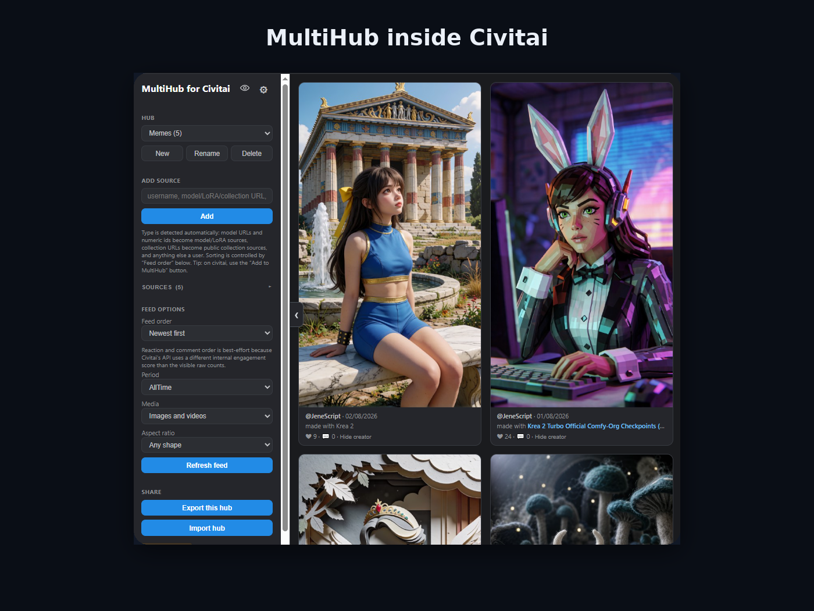
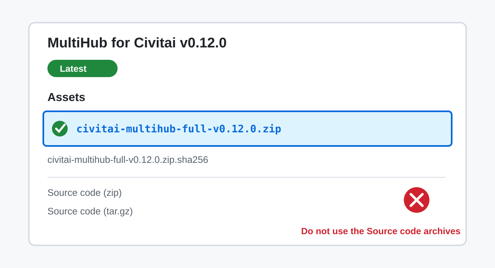
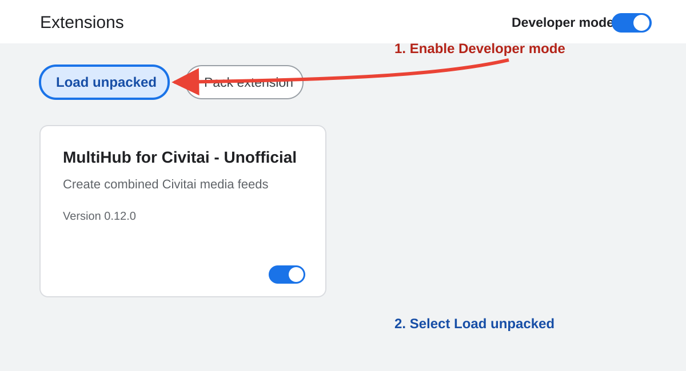
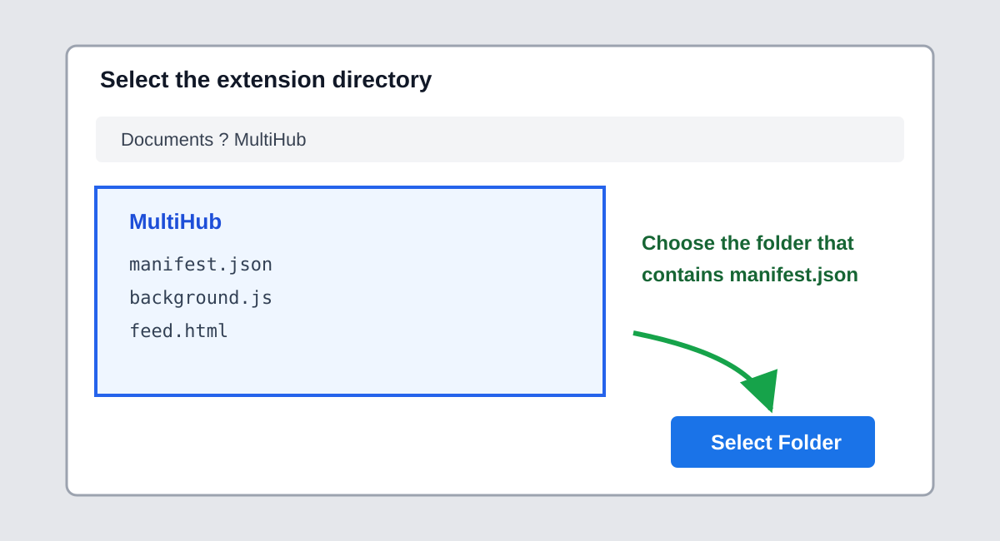
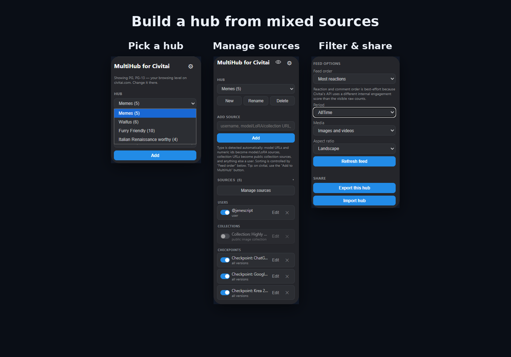

# MultiHub for Civitai - Unofficial

[](https://github.com/trunksn1/Civitai-MultiHub/actions/workflows/ci.yml)
[](LICENSE)

MultiHub combines selected Civitai creators, models, LoRAs, model versions, and public image
collections into personal feeds called **hubs**. Sources are merged, sorted together, and
deduplicated so they can be browsed from one focused feed.

MultiHub works in a standalone Chrome tab or directly below the Civitai header on
`civitai.com` and `civitai.red`.

> **Public preview (`0.12.0`).** MultiHub is an independent, unofficial project. It is not
> affiliated with or endorsed by Civitai. Installation currently uses Chrome's **Load unpacked**
> developer workflow, so updates are manual.



**[Install](#install-in-chrome)** | **[Quick start](#quick-start)** |
**[Features](docs/FEATURES.md)** | **[Privacy](PRIVACY.md)** |
**[Security](SECURITY.md)** | **[Report a bug](https://github.com/trunksn1/Civitai-MultiHub/issues)**

## Install in Chrome

Chrome cannot install this extension directly from a ZIP. Download it, extract it to a permanent
folder, and then load that folder.

1. Open the [latest Release](https://github.com/trunksn1/Civitai-MultiHub/releases/latest).
2. Under **Assets**, download `civitai-multihub-full-v0.12.0.zip`.
   Do **not** download GitHub's automatic `Source code` archives.
3. Extract the ZIP. Confirm that `manifest.json` is directly inside the extracted folder.
4. Open `chrome://extensions` in Chrome and enable **Developer mode**.
5. Select **Load unpacked** and choose the extracted folder containing `manifest.json`.
6. Refresh every Civitai tab that was already open.







For checksum commands, updates, removal, and troubleshooting, see the
**[complete installation guide](docs/INSTALLATION.md)**.

## Quick start

1. Open MultiHub from Chrome's extensions menu or from the **MultiHub** entry added to Civitai.
2. Create a hub, or use the starter hub.
3. Add a creator name, model ID, Civitai creator/model URL, or public image-collection URL.
4. Choose specific model versions when prompted, then select sorting and display filters.
5. Scroll the combined feed. Opening an item shows media details and the available Civitai actions.



## Main features

- Multiple independent hubs built from creators, models, LoRAs, versions, and collections.
- One globally sorted and deduplicated image/video feed.
- Newest, oldest, reactions, and comments sorting with time-period filters.
- Exact Civitai browsing-level handling on `.com` and `.red`.
- Embedded panel on Civitai plus a standalone extension tab.
- Viewed markers, post grouping, creator hiding, source aliases, and source organization.
- Image preview with generation data, resources, comments, replies, and Civitai links.
- Optional reactions, comments, and collection actions initiated explicitly by the user.
- Local hub export and import without API keys or viewed-history data.

The [feature guide](docs/FEATURES.md) explains sources, filters, account actions, browsing levels,
and the current limitations in more detail.

## Privacy, permissions, and API keys

The manifest requests only Chrome extension `storage` and host access to:

- `https://civitai.com/*`
- `https://civitai.red/*`

MultiHub does not request cookies, general browsing history, or access to unrelated websites. It
operates no analytics, advertising, telemetry, account, or application server.

When a signed-in Civitai tab is open, MultiHub can ask that tab to perform a fixed, validated set of
Civitai operations. The browser attaches the existing session cookie to same-origin requests;
MultiHub never reads, copies, stores, exports, or logs the cookie value.

Creator and model feeds work without an API key. A key is optional for reactions and as a fallback
for selected collection, comment, and generation-detail features when a signed-in Civitai tab is
unavailable. By default the key is kept in `chrome.storage.session`. Choosing **Remember this API
key on this device** also stores it in unencrypted `chrome.storage.local` until it is removed.

Use a limited, revocable Civitai key and grant only the scopes required for the actions you want.
Read [PRIVACY.md](PRIVACY.md) and [SECURITY.md](SECURITY.md) before entering a key.

## Mature content

`civitai.com` and `civitai.red` expose different content ranges. MultiHub follows the browsing
level selected on the Civitai host being used; that setting is read from Civitai and is never
changed by the extension. The `.red` host can expose mature user-generated content. Use it only
when appropriate for the user and environment.

## Known limitations

- Unpacked Chrome extensions do not update automatically.
- Civitai can change undocumented internal tRPC procedures used by optional features.
- MultiHub cannot infer a complete account-follow list from Civitai's current public API.
- Very large hubs can require many paginated Civitai requests and are subject to upstream limits.
- Browser integration still requires manual smoke testing in addition to the automated test suite.

## Development and verification

MultiHub has no runtime package dependencies. Its source is plain HTML, CSS, and JavaScript
modules.

```powershell
npm test
npm run build:all
npm run verify:packages
```

Release ZIPs are produced from an explicit file allowlist. Tests verify manifest permissions,
package contents, secret exclusions, deterministic archive bytes, storage normalization, source
parsing, API behavior, authenticated action payloads, and failure handling.

The repository's GitHub Action runs those commands for every push to `main` and every pull request.
It does not publish releases or change repository visibility.

## Contributing

Bug reports and focused pull requests are welcome. Read [CONTRIBUTING.md](CONTRIBUTING.md) before
submitting code. Report vulnerabilities through GitHub's private vulnerability-reporting flow;
do not place secrets or exploit details in a public issue.

## License

[MIT](LICENSE) | Copyright 2026 Civitai MultiHub contributors.
