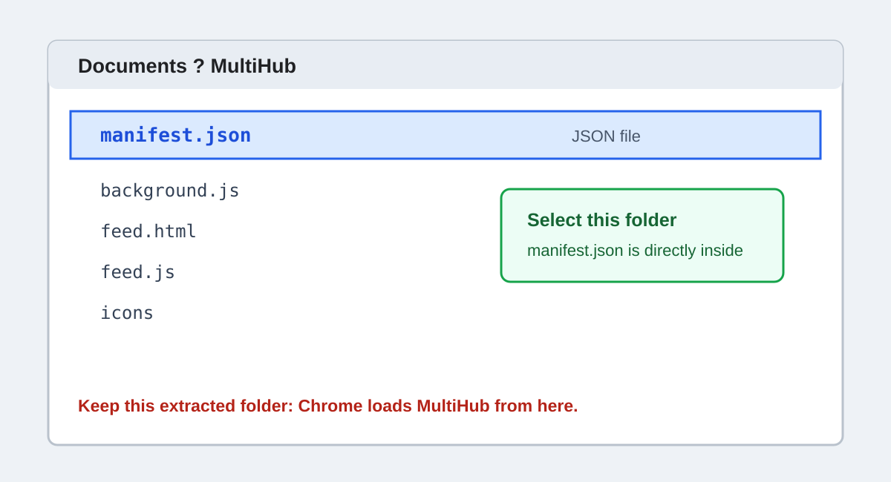

# Install MultiHub in Chrome

MultiHub is currently distributed as an unpacked Chrome extension. Chrome cannot load the ZIP
itself: the ZIP must be extracted and the extracted folder must remain on the computer.

## 1. Download the correct file

Open the [latest Release](https://github.com/trunksn1/Civitai-MultiHub/releases/latest), expand
**Assets**, and download:

`civitai-multihub-full-v0.12.0.zip`

Do not download `Source code (zip)` or `Source code (tar.gz)`. Those are automatic GitHub archives
intended for developers and have a different folder layout.


## 2. Optionally verify the download

Download `civitai-multihub-full-v0.12.0.zip.sha256` from the same Release.

On Windows PowerShell:

```powershell
Get-FileHash .\civitai-multihub-full-v0.12.0.zip -Algorithm SHA256
```

On macOS or Linux:

```bash
shasum -a 256 civitai-multihub-full-v0.12.0.zip
```

The resulting hash must match the value in the `.sha256` file and in the Release notes.

## 3. Extract the ZIP

Extract it to a permanent folder such as `Documents\MultiHub`. Open that folder and confirm that
`manifest.json` is directly inside it. Do not move or delete this folder while MultiHub is installed.



## 4. Load the extension

1. Enter `chrome://extensions` in Chrome's address bar.
2. Enable **Developer mode** in the top-right corner.
3. Select **Load unpacked**.
4. Choose the extracted MultiHub folder containing `manifest.json`.


Refresh any `civitai.com` or `civitai.red` pages that were already open. MultiHub can then be opened
from Chrome's extensions menu or from the entry added to Civitai.

## Update

1. Export important hubs as a precaution.
2. Download and verify the new Release ZIP.
3. Replace the files in the same permanent MultiHub folder.
4. Open `chrome://extensions` and select **Reload** on MultiHub.
5. Refresh open Civitai tabs and any standalone MultiHub tab.

Keeping the same folder path helps Chrome retain the existing unpacked installation and its local
extension storage.

## Remove

Export hubs you want to keep, open `chrome://extensions`, and select **Remove** on MultiHub.
Uninstalling removes Chrome-managed MultiHub storage. It cannot undo reactions, comments, or
collection changes already submitted to Civitai.

## Troubleshooting

- **Chrome says the manifest is missing:** select the folder containing `manifest.json`, not the ZIP
  or its parent folder.
- **The old interface is still visible:** reload the extension, then refresh the Civitai tab. Content
  scripts are injected when a page loads.
- **MultiHub reports that the Civitai session is unavailable:** open or refresh a signed-in Civitai
  tab on the same host and retry.
- **Mature media is missing:** verify the browsing level in Civitai's own header control and confirm
  that the intended `.com` or `.red` host is being used.
- **An optional action is unavailable:** Civitai may have changed an internal endpoint. Open the item
  on Civitai and check the latest MultiHub Release or Issues page.
